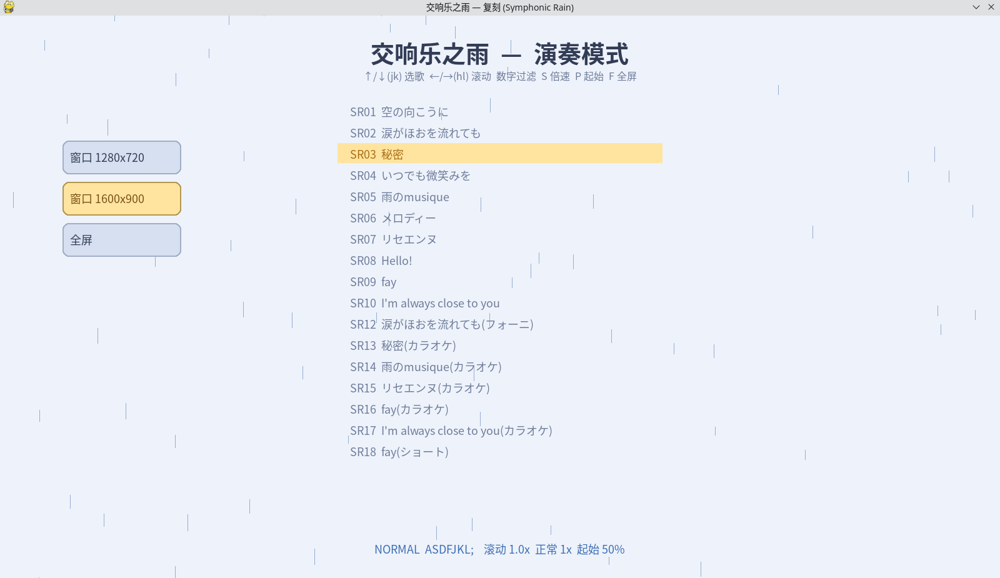
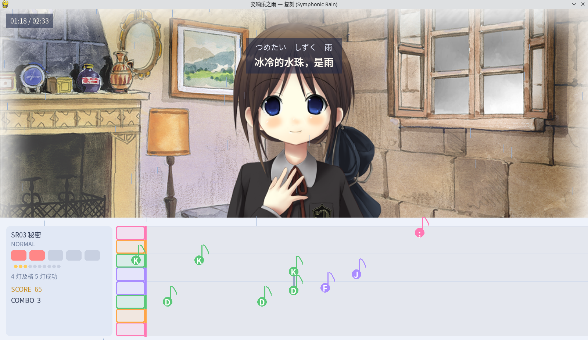

# 🎹 交响乐之雨 — 演奏复刻 (Symphonic Rain Rhythm Game)

> **版本 0.1.0** — 用 pygame 复刻《交响乐之雨》(Symphonic Rain) 的演奏模式

一款音乐演奏游戏：音符从右向左滚动，在判定线上按下对应的琴键，跟随**冈崎律子**的旋律完成演奏。谱面、音色、伴奏、背景演出全部提取自原版游戏（Steam 版）素材，并逆向还原了原版的难度键位、判定、计分与亮灯规则。

---

## 📸 游戏截图





---

## 🚀 运行方法

### 💻 Windows（推荐，零配置）

环境（Python / pygame / ffmpeg / 中文字体 / 全部素材）均已打包：

1. 到 **Release** 页面下载 `SymphonicRain-Windows-0.1.0.zip`
2. 解压后可见 `SymphonicRain.exe`
3. **双击运行**即可

> 首次启动需解包内置素材，稍慢属正常；曲目素材按需解压，玩过的曲目自动展开。

### 🐧 Linux

1. 下载源代码（Clone 或 Release 的 Source 包）
```bash
git clone https://github.com/LinOuyang/SymphonicRainReplication.git
```
2. 安装依赖：

```bash
pip install pygame            # Python 3.10+
# ffmpeg (倍速功能需要, 需含 libmp3lame 编码器):
sudo apt install ffmpeg       # Ubuntu/Debian
ffmpeg -encoders | grep mp3lame   # 确认 MP3 编码器可用
```

3. 运行：

```bash
cd SymphonicRainReplication
python main.py        # 或 ./run.sh
```

> 中文字体已内置在 `src/fonts.zip`（首次启动自动解压），Linux 下无需额外安装字体。

---

## 🎮 操作说明

### 主界面（选歌菜单）

| 按键 | 功能 |
|---|---|
| ↑ / ↓ 或 **k / j** | 选择歌曲（vim 风格） |
| ← / → 或 **h / l** | 滚动速度档位（0.4x ~ 1.3x） |
| **数字键 0-9** | 曲目过滤：只显示编号含该数字的曲目（再按同数字取消） |
| **S** | 倍速档位（0.5 / 0.75 / 0.9 / 1.0 / 1.1 / 1.25） |
| **P** | 起始位置（0% ~ 90%，每次 +10%） |
| **F** | 全屏 / 窗口切换 |
| 鼠标左键 | 点击左侧按钮切换 1280×720 / 1600×900 / 全屏 |
| Enter | 开始演奏 |
| ESC | 退出 |

### 演奏中

| 按键 | 功能 |
|---|---|
| **A S D F J K L ;** | 弹奏（8 轨道，音符圆内标注对应键） |
| **空格** | AUTO 自动演奏（右上角显示，期间不记录成绩） |
| ESC | 返回菜单 |

### 判定与计分

- 判定窗口：Perfect ±50ms / Great ±100ms / Good ±150ms，矩形判定框右边界 = 判定线
- 计分（原版规则减半）：完美 15 分起连击递增封顶 100；Great/Good 5 分；全灯 +50；按错扣 75 起递增封顶 225
- 亮灯系统：5 大灯 + 10 小灯，完美点亮，4 灯及格、5 灯成功

---

## ✨ 创新特色

### 🐢 慢速练习 — 新手友好
支持 **0.5x ~ 1.25x 音频变速**（保持音高，基于 ffmpeg atempo），配合 **0.4x ~ 1.3x 滚动速度**。慢速下音符间隔被拉长，适合新手先看清指法、跟上节奏，再逐步提速。

### 🎯 P 键起始位置 — 针对性练习
菜单按 **P** 可选择从曲目的 **0% ~ 90%** 任意位置开始，音乐与音符同步从该处起奏。配合慢速，可以反复练习**最难的那一段**，而不必每次都从头打起。

- 例如《秘密》(SR03 / SR13)：**50% 起始**附近正是密集和弦连打的难点段落，适合专项起手练习
- 高难度挑战推荐：法珞主题曲 **《雨之音》**（雨のmusique，SR05 / SR14）

### 🔢 数字过滤 — 快速选曲
按数字键即可过滤出编号含该数字的曲目：按 `3` 直接找到《秘密》与其卡拉OK版（SR03/SR13），成对练习同一曲目的不同难度。

### 🎨 原版还原
- 8 轨道对应**原版 NORMAL 指法映射**（谱面内部键按 QWERTY 标准指法归组，还原原版键位机制）
- 音符采用**音乐符号造型**（圆头 + 符杆 + 符旗），和弦带连接线并向中间靠拢
- **Anime 脚本驱动背景**：按原版演出脚本切换背景与帧动画，非简单轮播
- 双行歌词（日文原文 + 中文翻译）、浅色主题、主界面 BGM

---

## ⚙️ 源码玩家：自定义倍速

倍速档位在 `config.py` 中定义：

```python
SLOW_SPEEDS = [0.5, 0.75, 0.9, 1.0, 1.1, 1.25]   # S 键循环切换
```

- 修改此列表即可增删档位，例如加入 `0.6`、`0.8`，或去掉 `1.1`
- **范围限制**：ffmpeg atempo 单段支持 0.5 ~ 2.0，请在此范围内取值
- 修改后重启游戏生效；已生成的倍速缓存位于 `tmp/` 目录（删掉即可强制重新生成）

滚动速度档位同理（`SPEEDS`），只影响音符视觉提前量，不影响音乐与判定同步。

---

## 📦 项目结构

```
├── main.py          # 入口: 按需解压素材 + 启动游戏
├── app.py           # 应用: 菜单 / 结果 / 主循环 / BGM
├── play_scene.py    # 演奏场景: 判定 / 计分 / 亮灯 / 音符 / 背景 / 歌词
├── song.py          # 谱面与歌曲元数据 (支持 zip 形态读取)
├── utils.py         # 工具: 倍速音频生成 / 音符图形
├── config.py        # 全部配置常量 (速度 / 判定 / 计分 / 配色 / 倍速)
├── pack_src.py      # 素材打包脚本 (每曲目一个 zip)
├── build.bat        # Windows 打包脚本 (PyInstaller)
├── run.sh           # Linux 启动脚本
├── src/             # 素材 (zip 形态, 运行时按需解压)
└── readme_images/   # README 截图
```

---

## 🙏 致谢

- **《交响乐之雨》** 原作：工画堂スタジオ (KOGADO Studio)，音乐 **冈崎律子**（Ritsuko Okazaki）
- 谱面、音色、伴奏、背景、演出脚本提取自 Steam 版游戏资源（HyPack 容器逆向）
- KGO 解密/解压算法参考 [Zaikatana/KGO-RE](https://github.com/Zaikatana/KGO-RE)
- 原版难度键位、计分与亮灯规则参考社区攻略

## 📝 写在后面的话

这个项目源于对《交响乐之雨》的热爱。逆向解包、破解谱面加密、还原指法映射——每一步都像在拆解一封来自 2004 年的信。希望这份复刻能让更多人听到冈崎律子的旋律，也欢迎 Star、Issue 或 PR。

> ⚠️ 素材版权归原作者所有，本项目仅供学习交流，请勿用于商业用途。
